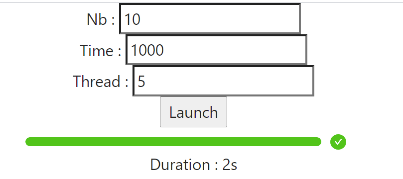

# Progress bar demo

The objective is te create quickly a simple progress bar to monitor running tasks on a backend server.
Update informations from server are sended with SSE.

Front simple page is made in React with [Axios](https://github.com/axios/axios) and [Ant design](https://ant.design/) (/resources/progresser)

Two implementations of backend is available : 
* Golang : I use chanel and WaitGroup (/go-version)
* Java : I use [BlockingQueue](http://tutorials.jenkov.com/java-util-concurrent/blockingqueue.html), ExecutorService and Spring mvc (/src)

